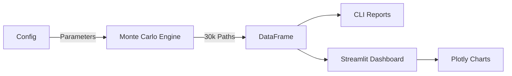

# Liquidity Risk in Highly Leveraged Real Estate PF

## Stochastic Cash Flow Modeling & Monte Carlo Risk Analysis

[](https://cookiecutter-data-science.drivendata.org/)

Monte Carlo simulation framework for quantifying liquidity risk in highly leveraged commercial real estate development projects. Analyzes default probability, refinancing viability, and equity IRR distributions through 30,000+ stochastic scenarios.

> **Confidentiality Notice:** All financial figures normalized and location details anonymized. Methodology and conclusions remain representative of real project analysis.

---

## 🚀 Quick Start

### Installation

```bash
git clone https://github.com/yourusername/pf-liquidity-risk.git
cd pf-liquidity-risk
python -m venv venv
source venv/bin/activate  # Windows: venv\Scripts\activate
pip install -r requirements.txt
```

### Run Simulation

```bash
# CLI version
python pf_liquidity_risk/modeling/train.py

# Interactive dashboard
streamlit run pf_liquidity_risk/app.py
```

---

## 📌 Executive Summary

**Project Profile:**

* Commercial parking tower development adjacent to new district court
* 77% initial LTV, 3.4x leverage
* **Critical 3-month window** between completion (Month 16) and refinancing (Month 19)

**Key Finding:** ~35% probability of failure (default or refinancing failure) under base-case assumptions, driven by:

1. Only 3 months post-completion to generate trailing NOI for refinancing
2. High construction rates (10-18%) continuing during this critical window
3. Insufficient revenue to cover debt service → rapid equity erosion

---

## 🎯 Core Problem: The 3-Month Refinancing Window

### Project Timeline

```
Month 0 ──────── Month 16 ─── Month 19 ──── Month 24 ──────── Month 36
   |                |             |             |                 |
Start          Completion    Refinancing  Court Opens        Exit
   |                |             |             |                 |
   └─Construction──┴─ 3mo Gap ───┴─Stabilization┴─ Full Ops ────┘
   
Interest:    10-18%        10-18%        5-9%          5-9%
Revenue:       0%         Starting     Ramp-up      Stabilized
Cap Ratio:    100%          40%          0%            0%
```

### The Challenge

| Phase | Timeline | Revenue | Interest | Risk |

|:---|:---|:---|:---|:---|
| **Construction** | 0-16m | Zero | 10-18% (100% capitalized) | Construction delays |
| **Critical Window** | 16-19m | Starting | 10-18% (40% capitalized) | **Highest equity burn** |
| **Refinancing Gate** | Month 19 | - | Rate reset | Refinancing failure risk |
| **Stabilization** | 19-24m | Ramp-up | 5-9% (0% capitalized) | Market risk |
| **Post-Opening** | 24-36m | Stabilized | 5-9% (0% capitalized) | Sustained operations |

**Month 16-19 (Critical 3-Month Window):**

* Building just completed - revenue starting from zero
* Still paying construction-phase rates (10-18% p.a.)
* Need 3-month trailing NOI for bank refinancing valuation
* Revenue only 20-50% of full capacity → insufficient to cover debt service
* **This is where most equity erosion occurs**

**Month 19 (Refinancing Gate):**

* Property value = (3-month trailing NOI × 12) / 5.5% cap rate
* Bank requirement: Current Debt ≤ Property Value × LTV (70-85%)
* **Success:** Interest drops to 5-9%, debt service manageable → survival likely
* **Failure:** Cannot refinance, rates stay at 10-18% → default likely within 3-6 months

**Month 24 (Court Opening):**

* District court opens → primary demand driver activates
* Revenue stabilizes at 80-100% capacity
* No longer a critical gate (already refinanced at Month 19)

---

## 📊 Key Results

### Outcome Probabilities (30,000 simulations)

| Outcome | Probability | Description |

|:---|:---:|:---|
| Successful Exit | 65% | Positive equity at Month 36 |
| Default | 25% | Equity wipeout before refinancing (Month 16-19) |
| Refinancing Failure | 10% | Debt exceeds LTV limit at Month 19 |

### Risk Metrics

* **95% VaR:** 75% of initial equity
* **Expected Loss:** 32% of equity base
* **Median IRR (exits):** 8.5% annualized
* **Survival Rate Bottleneck:** Month 16-19 (steepest decline due to 3-month window)

### Why Projects Fail

| Failure Mode | Probability | Timing | Root Cause |

|:---|:---:|:---|:---|
| **Default** | 25% | Month 16-19 | High rates + insufficient revenue → equity wipeout |
| **Refi Failure** | 10% | Month 19 | 3-month trailing NOI too low → can't meet LTV |
| **Success** | 65% | Month 36 | Survived both critical gates |

---

## 🔧 Interactive Dashboard Features

* **Real-time parameter adjustment**
  - Capital structure (equity, debt, fixed costs)
  - Revenue distributions (stabilization & post-opening phases)
  - Interest rate scenarios (pre/post refinancing)
  - Project timeline (completion, refinancing, court opening, exit)

* **Dynamic visualizations**
  - Outcome probability distribution
  - IRR histogram with percentiles
  - Month-by-month survival curve
  - Exit multiple analysis

* **Scenario comparison**
  - Save baseline scenarios
  - Compare deltas across runs
  - Track changes in key metrics

* **Bilingual interface** - English/Korean toggle

* **Export capabilities** - Download CSV results, save high-resolution charts

---

## 🛠️ Technical Stack

### Architecture



### Core Components

* **Simulation Engine:** `PFInvestmentModel` - Monthly cash flow paths with stochastic variables
* **Configuration:** `PFConfig` - Dataclass with triangular distributions for all parameters
* **Visualization:** Plotly interactive charts + Matplotlib static reports
* **Caching:** Streamlit @cache_data for instant re-runs with same parameters

### Stochastic Variables (Triangular Distributions)

| Variable | Min | Mode | Max | Applied Phase |

|:---|:---:|:---:|:---:|:---|
| Interest Rate | 10% | 14% | 18% | Pre-Refinancing (0-19m) |
| Interest Rate | 5% | 7% | 9% | Post-Refinancing (19-36m) |
| Monthly Revenue | 8.9 | 21.4 | 26.8 | Stabilization (indexed) |
| Monthly Revenue | 21.4 | 35.7 | 44.6 | Post-Opening (indexed) |
| Construction Delay | 0mo | 2mo | 6mo | One-time shock |
| Refinancing LTV | 70% | 80% | 85% | Month 19 gate |

---

## 💼 Use Cases

### For Developers

* **Pre-Investment Due Diligence:** Quantify probability of surviving the 3-month window
* **Capital Structure Optimization:** Test different debt/equity mixes
* **Contingency Planning:** Size equity reserves for construction delays + refinancing gap

### For Lenders

* **Credit Risk Assessment:** Evaluate refinancing failure probability
* **Covenant Structuring:** Set appropriate LTV thresholds for Month 19 gate
* **Portfolio Risk Management:** Stress test exposure across multiple PF loans

### For Investors

* **Risk-Adjusted Return Analysis:** Compare IRR distributions across deals
* **Liquidity Risk Quantification:** Understand 3-month window vulnerability
* **Exit Strategy Planning:** Identify optimal hold periods given refinancing risk

---

## 📈 Strategic Recommendations

### Pre-Construction

1. **Equity buffer:** Increase 30-40% above base case to absorb 3-month negative carry
2. **Rate hedging:** Fix construction rate ≤12% to reduce downside exposure
3. **Accelerated construction:** Reduce completion time 16→14 months to shorten high-rate period

### Critical Window (Month 16-19) - HIGHEST PRIORITY

1. **Pre-leasing:** Secure anchor tenant commitments BEFORE completion
2. **Aggressive lease-up:** Offer 2-3 months rent-free to accelerate occupancy
3. **Bridge financing:** Arrange mezzanine debt specifically for this 3-month gap
4. **Operating reserves:** Pre-fund 3 months of debt service shortfall
5. **Early revenue optimization:** Price competitively to hit 50%+ occupancy by Month 17

### Refinancing (Month 19)

1. **Conservative LTV target:** Aim for 70% (not 80-85%) for stress approval
2. **NOI documentation:** Ensure 3-month trailing average ≥ minimum threshold
3. **Lender pre-commitment:** Negotiate refinancing terms 6 months in advance
4. **Alternative lenders:** Line up backup refinancing sources

### Post-Refinancing (Month 19-36)

1. **Debt paydown:** Use excess cash flow to reduce principal aggressively
2. **Court opening coordination:** Monitor district court construction timeline
3. **Exit timing:** Optimize sale timing for maximum stabilized NOI multiple

---

## ⚠️ Limitations & Assumptions

### Model Assumptions

1. **Interest rates independent across phases** - No correlation between pre/post refi rates
2. **Revenue distributions static** - Does not account for market cyclicality
3. **No explicit macroeconomic scenarios** - Recession, rate shocks not modeled
4. **Single-asset analysis** - Portfolio diversification effects not considered
5. **Fixed refinancing timing** - Month 19 not optimized dynamically
6. **Deterministic court opening** - Month 24 assumed certain (not stochastic)

### Data Requirements

* Accurate construction timeline estimates
* Reliable market rent/occupancy data for 3-month ramp-up
* Lender refinancing appetite (LTV assumptions)
* District court construction schedule certainty

### Not Suitable For

* ❌ Early-stage land banking projects
* ❌ Multi-phase developments with complex waterfall structures
* ❌ International projects with FX risk
* ❌ Projects with significant regulatory uncertainty
* ❌ Residential projects with different absorption patterns

---

## 📁 Project Structure

```text
├── pf_liquidity_risk/
│   ├── modeling/
│   │   ├── config_model.py    # PFConfig dataclass
│   │   └── train.py            # Monte Carlo engine
│   ├── configs/
│   │   ├── public_config.py    # Normalized params (committed)
│   │   └── private_config.py   # Real params (gitignored)
│   └── app.py                  # Streamlit dashboard
├── reports/figures/            # Output visualizations
├── requirements.txt
└── README.md
```

---

## ❓ FAQ

**Q: Why only 3 months between completion and refinancing?**  
A: Banks require trailing NOI to value the property, but construction lenders demand repayment soon after completion. 3 months is the minimum window to build operating history while maintaining construction loan terms.

**Q: Why not refinance at Month 16 (immediately at completion)?**  
A: Zero operating history at completion. Banks need at least 3 months of trailing NOI to underwrite refinancing. Earlier than Month 19 is typically not feasible.

**Q: What if the 3-month NOI is weak but improving?**  
A: Most banks use trailing 3-month average. A weak start (Month 16-17) can sink the average even if Month 18-19 is strong. This is why pre-leasing is critical.

**Q: Can you delay refinancing beyond Month 19?**  
A: Construction loans typically have strict maturity dates (often 18-24 months post-completion). Extending requires underwriting equivalent to refinancing, so no advantage to delaying if you can refinance successfully.

**Q: What's the relationship between court opening (Month 24) and refinancing (Month 19)?**  
A: Court opening is the primary demand driver but occurs 5 months AFTER refinancing. Banks at Month 19 are betting on future demand. If court construction is delayed, refinancing becomes much harder.

**Q: Simulation runtime?**  
A: 2-5 seconds for 30,000 iterations on modern hardware. Dashboard is cached for instant re-runs with identical parameters.

**Q: Can this be adapted for residential projects?**  
A: Yes, but adjust the revenue ramp-up curve (residential absorption is typically 6-12 months, not 3 months) and interest capitalization ratios.

---

## 🤝 Contributing

Contributions welcome! Priority areas:

* Correlation structures between interest rates and revenue
* Sensitivity analysis visualizations (tornado diagrams)
* Mezzanine debt waterfall logic
* Jupyter notebook tutorials
* Additional output formats (Excel reports)

---

## 📚 Citation

```bibtex
@software{kim2025pf_liquidity_risk,
  author = {Kim, Minsung},
  title = {PF Liquidity Risk: Monte Carlo Simulation Framework for Real Estate Project Finance},
  year = {2025},
  url = {https://github.com/yourusername/pf-liquidity-risk},
  note = {Stochastic analysis of refinancing risk in leveraged commercial real estate development}
}
```

---

## 📧 Contact

**Author:** Minsung Kim  
**Repository:** [github.com/yourusername/pf-liquidity-risk](https://github.com/yourusername/pf-liquidity-risk)  
**Issues:** [GitHub Issues](https://github.com/yourusername/pf-liquidity-risk/issues)

---

## 📄 License

MIT License - See [LICENSE](LICENSE) file for details

---

**Built with:** Python • NumPy • Pandas • Streamlit • Plotly  
**Methodology:** Monte Carlo Simulation • Stochastic Modeling • Project Finance Risk Management