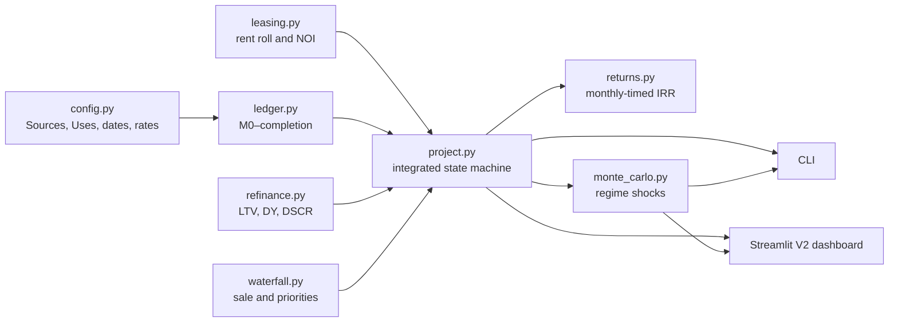

# PF Risk Simulator: V2 Architecture

V2 is a contract-driven, monthly cash-flow model for one synthetic Korean
income-producing development. It is implemented beside the legacy V1 engine so
that old behavior remains reproducible while the new economics can be reviewed
independently.

## Execution graph



## Module responsibilities

| Module | Owns | Does not own |
|---|---|---|
| `config.py` | Development budgets, commitments, milestone dates, financing terms | Scenario sampling |
| `ledger.py` | Development draws, uses, cash, debt balances, funding default | Leasing and valuation |
| `leasing.py` | Occupancy, rent-free, collection loss, operating costs, Property NOI | Interest and debt |
| `refinance.py` | Take-out capacity and closing sources | Sale recovery |
| `waterfall.py` | Sale valuation and debt/equity distribution | Monthly construction draws |
| `returns.py` | Periodic IRR and realized equity multiple | Cash-flow creation |
| `project.py` | End-to-end states, cure, extension, refinancing, exit | Random-number generation |
| `monte_carlo.py` | Seeded regime and conditional shock sampling | Alternative accounting rules |

## State sequence

```text
land acquisition
→ predevelopment
→ main-PF conversion
→ construction/completion
→ lease-up
→ take-out test
    ├─ close → operations → Month 60 sale
    └─ shortfall → one extension
         ├─ second close → operations → sale
         └─ second shortfall/default → distressed sale
```

Sponsor cures are commitments, not automatic cash. A refinancing cure is funded
only if the take-out and cure together close the transaction. At an operating
default, unpaid current interest or extension fee becomes a transparent
capitalized senior claim before collateral liquidation.

## Core invariants

Every deterministic and sampled path is checked for:

```text
opening cash + sources - uses = closing cash
closing debt = opening debt + draw/accrual - repayment
facility draws <= commitments
debt balances >= 0
combined equity cash flow = sponsor cash flow + preferred cash flow
terminal sale closing cash = 0
```

The tests cover base-case checkpoints, failed refinancing, sponsor cure,
extension, distressed sale, monthly IRR, seeded simulation reproducibility, and
CLI exports.

## Running V2

```bash
cd pf-risk-simulator
source venv/bin/activate

# Deterministic summary
python -m pf_liquidity_risk.modeling.v2 base

# Deterministic monthly ledger
python -m pf_liquidity_risk.modeling.v2 base \
  --ledger-output reports/v2_base_ledger.csv

# Seeded Monte Carlo and scenario rows
python -m pf_liquidity_risk.modeling.v2 simulate \
  --iterations 1000 \
  --seed 42 \
  --output reports/v2_scenarios.csv

# Standalone V2 UI
streamlit run pf_liquidity_risk/v2_app.py
```

## Interpretation boundary

The base deal and the regime distributions are synthetic. The engine supports
underwriting and stress-analysis logic; it does not yet establish that the
chosen inputs are representative of a particular asset, date, lender, or
Korean market segment.

Before external decision use, add:

1. dated rent-roll and lease-comparable calibration;
2. construction budget and change-order history;
3. lender term sheets for advance rate, DSCR, Debt Yield, fees, amortization,
   reserves, and covenants;
4. observed cap-rate and distressed-recovery data;
5. taxes, leasing commissions, tenant improvements, capital expenditure, and
   legal guarantee mechanics;
6. back-testing and out-of-sample validation.
